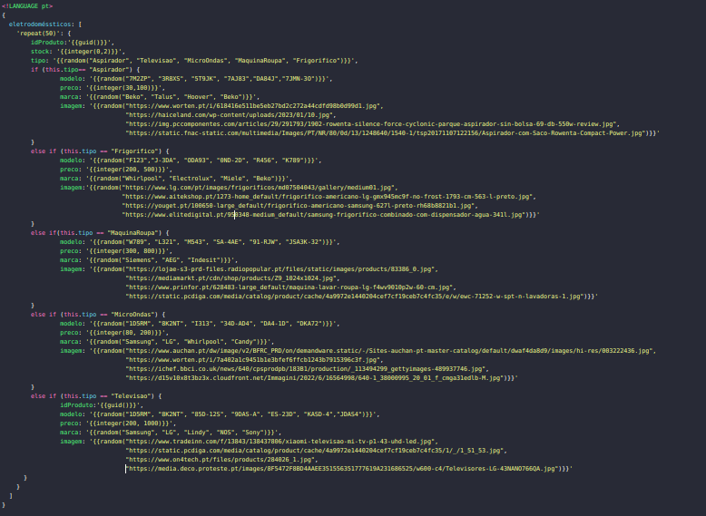

# Índice

- [Índice](#índice)
- [Introdução](#introdução)
- [Levantamento de Requisitos](#levantamento-de-requisitos)
- [Estrutura/Desenvolvimento](#estruturadesenvolvimento)
- [Dataset Produtos](#dataset-produtos)
- [Interface](#interface)
- [Conclusão](#conclusão)

# Introdução

O presente relatório descreve o trabalho prático realizado no âmbito da Unidade Curricular de Engenharia Web, inserida no curso de Licenciatura em Engenharia Informática durante o 2º Semestre do ano letivo 2022/2023.
Neste projeto, o grupo optou por escolher o seu próprio tema, que consiste na criação de uma plataforma de suporte a uma empresa de eletrodomésticos.
O objetivo deste trabalho é desenvolver uma plataforma com dois tipos distintos de utilizadores: os clientes e os administradores.
Os clientes podem visualizar informações acerca da empresa, ver e comprar produtos, e enviar e-mails.
Os administradores têm acesso a funcionalidades adicionais, como a gestão do estoque de produtos.

O relatório está dividido em várias seções. Iniciamos com a introdução, que apresenta uma visão geral do trabalho realizado. Em seguida, abordamos a análise e especificação, onde descrevemos informalmente o problema a ser resolvido e estabelecemos os requisitos necessários para a sua resolução. Posteriormente, apresentamos a conceção/desenho da solução, detalhando as estratégias adotadas para o desenvolvimento da plataforma. Prosseguimos com a seção de codificação e testes, onde descrevemos o processo de implementação e os testes realizados para verificar a correta funcionalidade da plataforma. Por fim, concluímos o relatório com uma síntese das principais conclusões obtidas ao longo do projeto.

O objetivo final deste trabalho é fornecer uma plataforma que atenda às necessidades da empresa de eletrodomésticos, permitindo aos clientes interagir com a empresa de forma eficiente e aos administradores gerir o estoque de produtos de forma adequada.

# Levantamento de Requisitos

- [x] É possível vizualizar as informações e os produtos sem realizar autenticação;
- [X] Qualquer utilizador pode preencher um formulário com o seu nome, mail e conteúdo de modo a essa informação ser mandada para o email da empresa.
- [ ] Adicionar a possibilidade de fazer upload de uma foto e mandar por email.  
- [x] Caso um utilizador desejar adicionar um produto à sua lista de favoritos ou comprar um produto deverá realizar autenticação: username+password;
- [x] Deverá ser possível criar uma nova conta, através do registo, onde será preciso fornecer um username, um nome e uma password para criar a conta.
- [x] Deverão existir pelo menos 2 níveis de acesso:
	- Administrador - pode alterar o stock dos produtos;
	- Cliente - pode adicionar produtos à sua lista de favoritos, filtrar e comprar produtos;
- [x] O Cliente deverá conseguir vizualizar apenas os produtos com stock superior a 0.
- [x] O cliente deve conseguir filtrar os produtos por preço ascendente/descente e pelo tipo do produto (Frigorífico, Micro-ondas, Aspirador, Máquina de lavar a roupa e Televisão);
- [x] O cliente deverá conseguir vizualizar os produtos adicionados aos Favoritos e ao Carrinho;
- [x] O cliente deverá conseguir remover produtos dos Favoritos e do Carrinho;
- [ ] O cliente deverá conseguir comprar os produtos do Carrinho, diminuindo o stock dos mesmos e ficando o Carrinho vazio.
- [ ] O Administrador deverá conseguir adicionar e remover um produto;
- [x] O Administrador deverá conseguir vizualizar todos os produtos e alterar o seu stock;
- [x] O website deverá ter uma barra de navegação para o utilizador poder navegar facilmente entre as diferentes páginas
- [x] O website deverá ter um footer com algumas informações de contacto com a empresa.
- [x] O website deverá ter uma página Produtos diferente para cada tipo de utilizador.
- [ ] Quando é registado um novo utilizador este recebe um email de confirmação para validar a sua conta, só após a validação é que este pode fazer login

É importante ressaltar que os requisitos estabelecidos serviram como guia para o desenvolvimento, porém, devido a restrições de tempo ou por o grupo considerar que não eram essenciais para proporcionar uma melhor experiência ao utilizador, alguns requisitos não foram implementados.

# Estrutura/Desenvolvimento

Neste capítulo, irá ser abordado a estruturação e o desenvolvimento do projeto em termos de codificação. O projeto foi organizado em três subaplicações essenciais:

1. Autenticação: Nesta etapa, foi implementado um sistema de autenticação para garantir a segurança da plataforma. A autenticação é necessária para assegurar que os utilizadores tenham acesso apenas às ações específicas permitidas, de acordo com seus níveis de acesso. 

2. API de Dados: Foi utilizado uma base de dados, através do software MongoDB, para armazenar informações dos produtos e users. Esta permite a criação, leitura, atualização e exclusão de dados, proporcionando uma iteração entre a plataforma e a base de dados de forma segura e eficiente.
   
4.  Interface: A interface permite que os utilizadores possam interagir com a plataforma de uma forma mais simples e intuitiva. Para a sua realização foram utilizadas tecnologias web, como Pug, CSS e JavaScript.

O desempenho correto e total da plataforma só é conseguido através do trabalho conjunto de cada uma das partes referidas em cima.
Esta estururação permite que o projeto seja dividido em módulos independentes, facilitando o desenvolvimento, manutenção e escalabilidade da plataforma.

# Dataset produtos

Na criação do dataset dos produtos foi usado o site https://datagen.di.uminho.pt/.
Inicialmente, surgiram algumas dificuldades devido ao facto de que para cada tipo de produto (Frigorífico, Máquina de Lavar Roupa, Micro-ondas, Televisão e Aspirador) era desejado obter diferentes informações, como imagens, marcas, modelos e preços. No entanto, consegui-se ultrapassar essas dificuldades e chegou-se à seguinte script:

Através desta script foi possível gerar um dataset com 50 produtos de eletrodomésticos, onde cada produto possui um ID, informações sobre o stock, tipo de eletrodoméstico, modelo, preço, marca e uma imagem correspondente.

# Modo de funcionamento

Inicialmente é necessário importar a base de dados usando o dataset criado. Para isso basta fazer mongoimport -d ProjetoEW -c produros --file dataset.json --jsonArray.
De seguida é necessário fazer npm i seguido de npm start na pasta API, auth-server e Interface e o programa está prontos a correr!

# Interface

# Conclusão

Em conclusão, o grupo está satisfeito com os conhecimentos adquiridos e os resultados alcançados neste projeto, apesar dos desafios enfrentados ao longo do caminho.

Embora se tenha cumprido os objetivos principais deste trabalho, há que reconhecer que ainda há muito espaço para melhorias e expansões futuras. Por exemplo, a implementação de recursos adicionais, como o envio de ficheiros por email, melhoramento do processo de compra no carrinho, confirmação de conta por email para novos utilizadores, remoção e adição de novos produtos por parte do administrador, etc...

Contudo, o grupo considera que, com alguns ajustes, a plataforma desenvolvida poderá ter um impacto positivo na empresa de eletrodomésticos, proporcionando aos utilizadores uma experiência agradável e satisfatória. 

